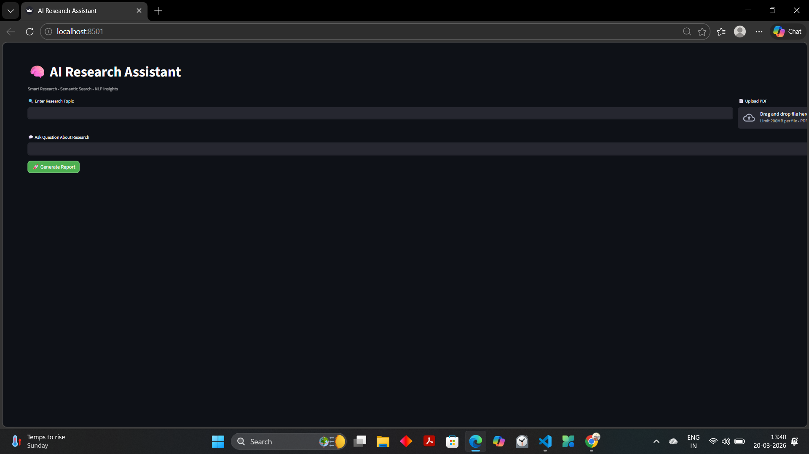
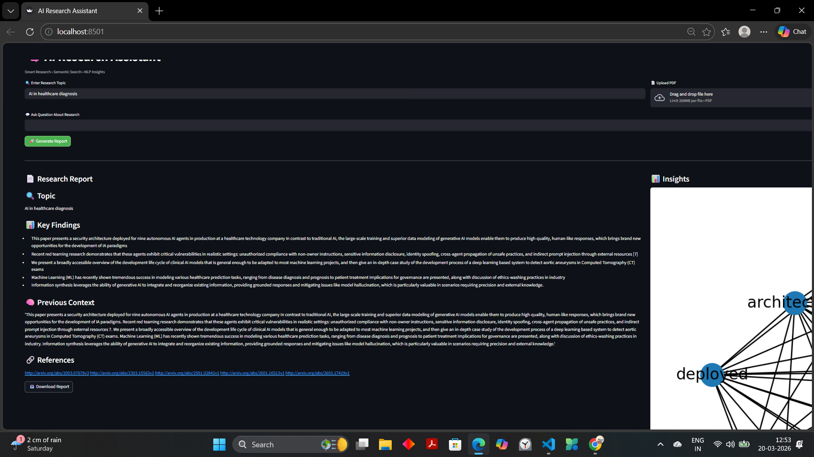
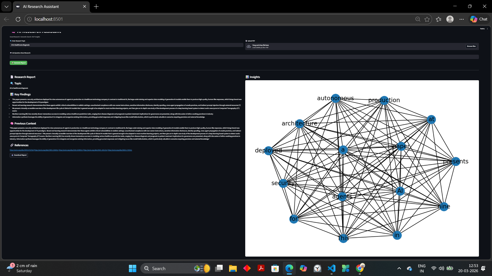
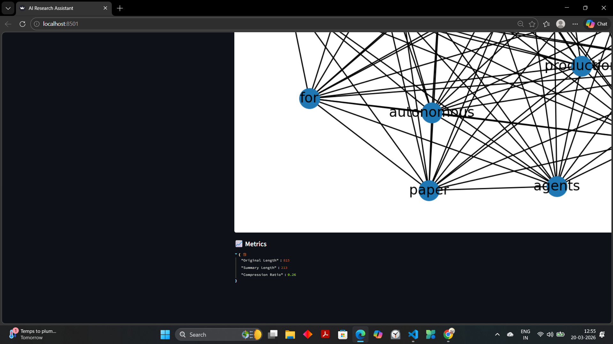

# 🧠 Hybrid Multi-Agent Research System


An AI-powered research assistant that automates literature review by extracting, filtering, and summarizing research papers using NLP and semantic search — without relying on paid APIs.

---

## 🚨 Problem Statement

Understanding research papers is time-consuming and inefficient due to:

* 📄 Large volume of academic papers
* ⏳ Manual effort required for literature review
* 🔍 Difficulty in extracting relevant insights
* 🤯 Complex technical language

---

## 💡 Solution

This system provides an **automated research assistant** that:

* Retrieves research papers from Arxiv or uploaded PDFs
* Filters relevant information using semantic search
* Summarizes content using NLP techniques
* Visualizes key concepts through knowledge graphs

👉 Result: **Faster, scalable, and more efficient research analysis**

---

## 🏗️ System Architecture

```text
User Input
   ↓
Data Collection (Arxiv API / PDF Upload)
   ↓
Semantic Search (TF-IDF Chunk Retrieval)
   ↓
NLP Summarization
   ↓
Report Generation
   ↓
Knowledge Graph + Evaluation Metrics
```

---

## 🚀 Features

* 🔍 Research Paper Retrieval (Arxiv API)
* 📄 PDF Upload & Text Extraction
* 🧠 NLP-Based Summarization (TF-IDF)
* 🔎 Semantic Search (Mini RAG)
* 📊 Evaluation Metrics (Compression Ratio)
* 📈 Knowledge Graph Visualization
* 🧠 Memory-Based Context Tracking
* 📥 Downloadable Reports

---

## 🎬 Live Workflow

1. Enter a research topic or upload a PDF
2. System retrieves and processes research data
3. Semantic search filters relevant content
4. NLP generates structured summary
5. Knowledge graph visualizes key concepts

👉 Entire pipeline executes in seconds

---

## 📸 Demo & Features

### 🖥️ Main Interface



👉 Users can input a topic or upload a PDF to generate research insights.

---

### 📄 Research Report



👉 Automatically generated structured report including:

* Key findings
* Context memory
* References

---

### 📊 Knowledge Graph



👉 Visualizes relationships between key concepts.

---

### 📈 Evaluation Metrics



👉 The system evaluates summarization quality using:

* Original vs Summary length
* Compression Ratio

👉 Helps measure efficiency of information extraction.

---

## 📊 Example

### Input

```
AI in healthcare diagnosis
```

### Output

* Summarized research report
* Key insights
* References
* Graph visualization

---

## ⚙️ Tech Stack

* Python
* Streamlit
* Scikit-learn
* NLTK
* NetworkX
* PyPDF2

---

## 📂 Project Structure

```text
multi-agent-research-system/
├── app/                # Streamlit UI
├── src/                # Core logic
├── data/               # Uploaded PDFs
├── logs/               # Logs
├── notebooks/          # Experiments
├── assets/             # Screenshots
├── requirements.txt
└── README.md
```

---

## 🖥️ Run Locally

```bash
git clone https://github.com/swati-mishra07/multi-agent-research-system
cd multi-agent-research-system

python -m venv .venv
.venv\Scripts\activate

pip install -r requirements.txt

python src/setup_nltk.py

streamlit run app/main.py
```

---

## 📈 Evaluation Metrics

* Compression Ratio
* Summary Length vs Original Length

👉 Helps measure summarization effectiveness

---

## 🧠 Future Improvements

* Vector database integration (FAISS)
* Advanced semantic search
* Cloud deployment
* Enhanced UI/UX

---

## 👩‍💻 Author

Swati Mishra

GitHub: https://github.com/swati-mishra07
LinkedIn: https://www.linkedin.com/in/swati-mishra-801193308

---


